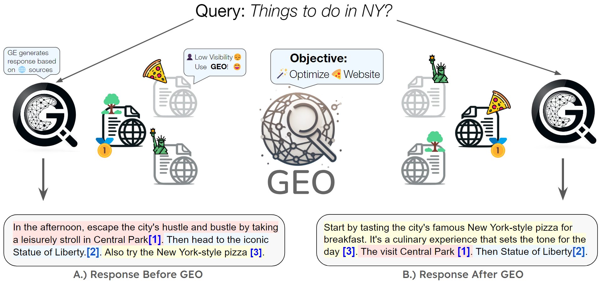

# GEO: Generative Engine Optimization

<div class="badge-container">
    <a href="https://generative-engines.com/GEO/" class="badge">
        
    </a>
    <a href="https://huggingface.co/datasets/GEO-optim/geo-bench" class="badge">
        
    </a>
    <a href="https://arxiv.org/abs/2311.09735" class="badge">
        
    </a>
    <a href="https://huggingface.co/spaces/GEO-optim/geo-bench" class="badge">
        
    </a>
</div>

## TLDR

**GEO** introduces optimization techniques to boost website visibility in generative engine responses.

## Abstract
> The advent of large language models (LLMs) has ushered in a new paradigm of search engines that use generative models to gather and summarize information to answer user queries. These Generative Engines are reshaping search engines, promising personalized and precise responses to user queries. Yet, content creators grapple with a lack of control over how their content appears in these engines. Enter GENERATIVE ENGINE OPTIMIZATION (GEO), a solution that empowers content creators with a set of optimization strategies to enhance their online visibility. To evaluate GEO, we introduce GEO-BENCH, a collection of diverse user queries from different sources, each tagged with relevant categories and corresponding search resutls. Our experiments reveal that GEO can boost source visibility by up to 40%, offering practical insights for content creators. GEO heralds a new era in information discovery systems, promising profound implications for both search engine developers and content creators
>




## Installation

1. Create a conda environment: conda create -n geo python=3.9
2. conda activate geo
3. pip install -r requirements.txt


## Run GEO

To replicate results in paper, simply run:
```python
cd src
python run_geo.py
```

## Define new GEO functions

You can define custom GEO functions in `src/geo_functions.py`. Reference them in `src/run_geo.py` in `GEO_METHODS` variable, to evaluate on your new custom GEO function. 

## GEO-BENCH

GEO-bench is hosted on huggingface, can be downloaded using:
```python
from datasets import load_dataset
load_dataset('GEO-optim/geo-bench')
``` 

## Leaderboard

Leaderboard is available at: [https://huggingface.co/spaces/Pranjal2041/GEO-bench](leaderboard)

## Citation

```
@misc{aggarwal2023geo,
      title={GEO: Generative Engine Optimization}, 
      author={Pranjal Aggarwal and Vishvak Murahari and Tanmay Rajpurohit and Ashwin Kalyan and Karthik R Narasimhan and Ameet Deshpande},
      year={2023},
      eprint={2311.09735},
      archivePrefix={arXiv},
      primaryClass={cs.LG}
}
```
